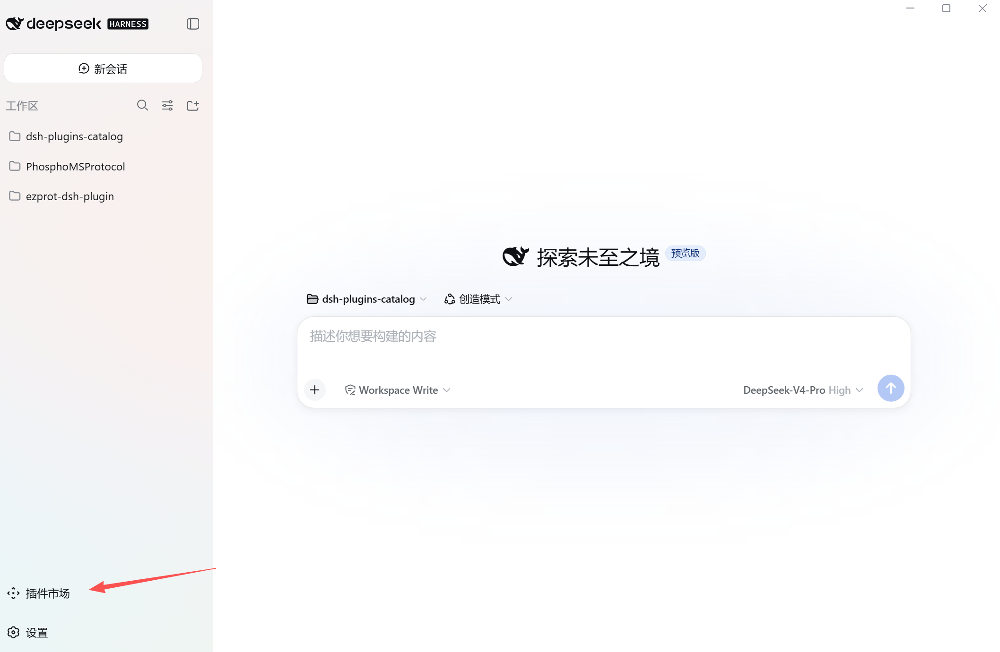
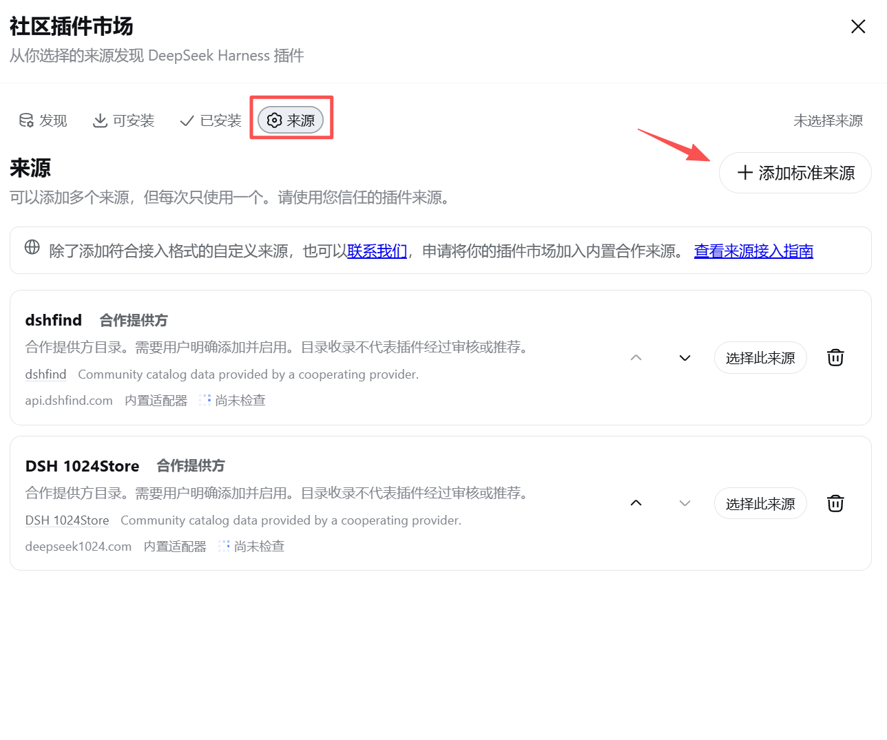
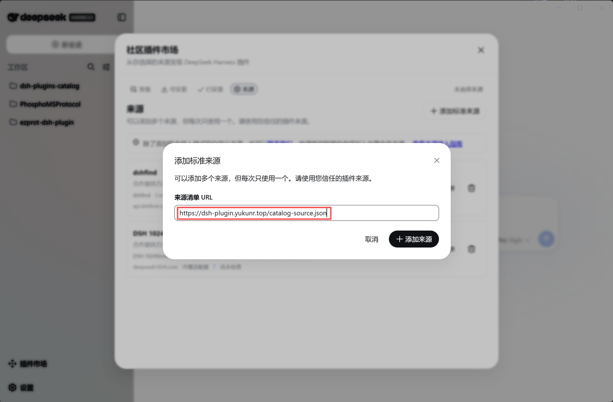
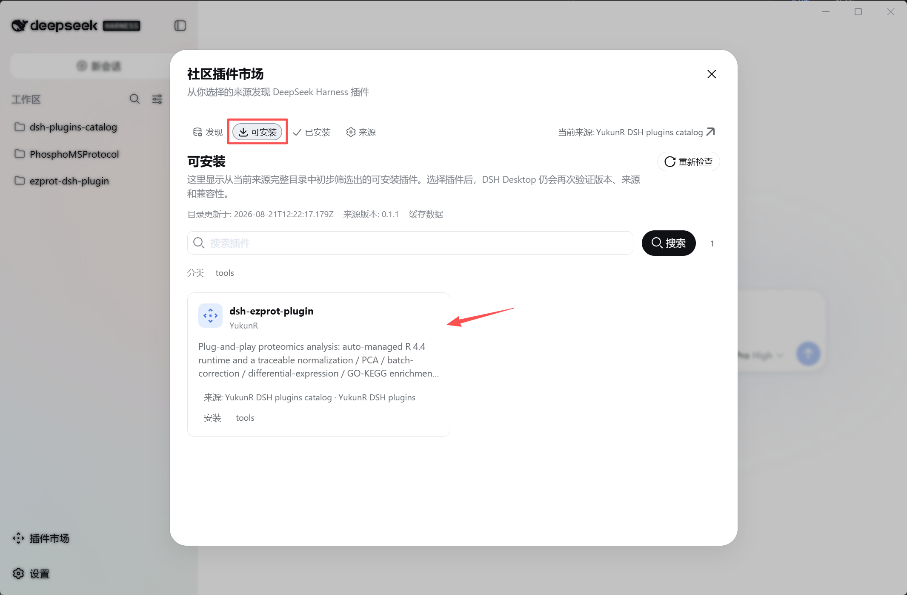
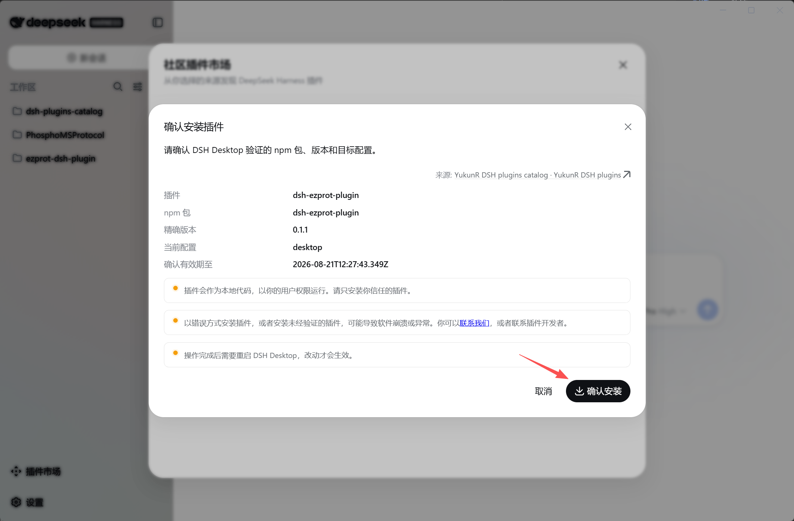
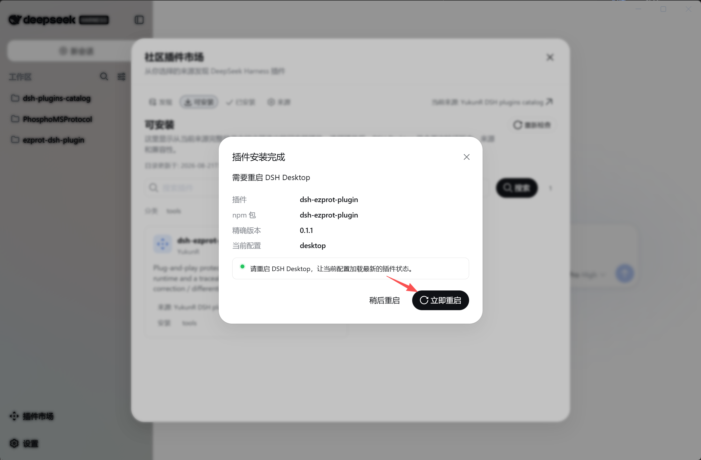

# 安装指南（DSH Desktop 插件市场）

[English install summary](../README.md#install) | 中文

本文演示如何在 **DSH Desktop** 中通过内置插件市场安装 `dsh-ezprot-plugin`。
全部操作都在图形界面完成，不需要碰终端。

## 前置条件

- 已安装 DSH Desktop（自带 Node.js 与 pnpm，无需另装）；
- 保证网络可访问 `dsh-plugin.yukunr.top`。

## 步骤

### 第 1 步：打开「设置 → 插件」

启动 DSH Desktop，进入 **设置（Settings）→ 插件（Plugins）**。



### 第 2 步：进入插件市场的「来源」视图

在插件页中找到 **插件市场（Plugin market）** 标签页，切换到 **来源（Sources）** 视图。



### 第 3 步：添加标准来源

点击 **添加标准来源（Add standard source）**，粘贴目录地址：

```
https://dsh-plugin.yukunr.top/catalog-source.json
```

确认后，该来源会出现在来源列表中。



### 第 4 步：在「可安装」页找到插件

切回 **可安装（Installable）** 视图，搜索 `ezprot`，出现 `dsh-ezprot-plugin` 卡片。



### 第 5 步：点击卡片并确认安装

点击卡片，Desktop 会先对 `dsh-ezprot-plugin@0.1.1` 做版本、来源与兼容性复核，
然后在弹窗中显示精确安装目标与当前 profile，确认后开始受管安装。



### 第 6 步：重启并验证

安装完成后选择 **立即重启（Restart now）**。重启后新建一个会话，直接让 agent 运行：

```
proteomics_environment action=status
```

返回 R 运行时状态即安装成功，8 个 `proteomics_*` 工具全部可用。



## 命令行安装（等价方式）

不使用 Desktop 市场时，可以用一条命令安装到 `web` profile：

```bash
npx @deepseek-ai/dsh plugin --profile web add dsh-ezprot-plugin@0.1.1
```

> 版本号固定，保证命令始终安装该精确版本：pnpm 11 的供应链策略对裸
> `add <包名>`（以及 `@latest`）只解析发布满 24 小时的版本，因此新版本
> 发布后的第一天内，不带版本号的写法可能会静默装上旧版本。

## 常见问题

| 现象 | 处理 |
|---|---|
| 添加来源失败（来源操作失败） | 检查网络可访问 `dsh-plugin.yukunr.top`；确认系统 IPv6 可用（Desktop 客户端对自建来源会固定使用解析到的第一个地址） |
| 发现页没有 ezprot 卡片 | 确认来源已选择；在来源页点刷新后重试 |
| 安装后工具未出现 | 需要重启 Desktop 才会把新 bundle 装入组合；确认安装到了当前激活的 profile |
| 环境安装耗时较长 | 首次使用时插件会自动安装 R 4.4.0 与全部依赖（一次性，约 10–20 分钟），属正常现象 |
